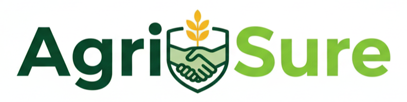

AgriSure - A Secure Contract Farming Ecosystem

AgriSure is a comprehensive platform built to digitize and secure the process of contract farming. By creating a single source of truth, we aim to empower farmers with guaranteed buyers and fair pricing, while providing agribusinesses with a predictable and high-quality supply chain.

Key Features:

👤 User Management: Separate, secure Dashboard for Farmers and Agribusinesses.

📄 Digital Contract Creation: A simple wizard to create and digitally sign farming contracts.

Tech Stack: HTML, CSS, JavaScript, React.js, Node.js, Express.js, MongoDB, Tailwind.css

<h2>AgriSure - A Secure Contract Farming Ecosystem<h2>

<strong>A comprehensive platform built to digitize and secure the process of contract farming.</strong>
 
By creating a single source of truth, we aim to empower farmers with guaranteed buyers and fair pricing, while providing agribusinesses with a predictable and high-quality supply chain.

